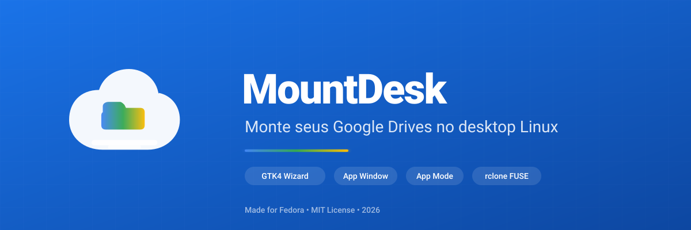
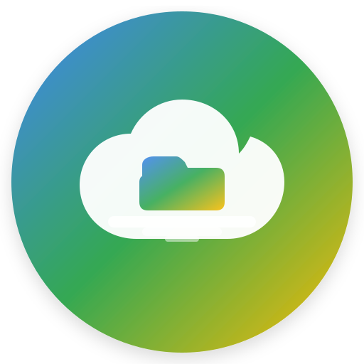

<p align="center">
  
</p>

<h1 align="center">MountDesk</h1>

<p align="center">
  <a href="https://github.com/andreahlert/mountdesk/actions/workflows/build.yml">
    
  </a>
  
  
  
  
  
</p>

<p align="center">
  <b>Mount any cloud storage to your Linux desktop</b> — Google Drive, OneDrive, Dropbox, SFTP, and 70+ backends via <a href="https://rclone.org/">rclone</a> FUSE mounts.
</p>

<p align="center">
  
</p>

---

## ✨ Features

- **🖥️ Desktop App Window** — GTK4 main window showing all drives, status, and quick actions
- **🧙 Zero-config Wizard** — GUI OAuth setup. No text files, no terminal copy-paste
- **📁 App Mode** — Double-click Google files to open in Chrome app windows (no browser chrome)
- **🎨 Correct Icons** — Google Docs/Sheets/Slides show proper colored icons in your file manager
- **📂 File Manager Integration** — Nemo extension with "Open in Google Drive" context menu
- **🔔 System Tray** — GTK tray app with per-drive status and controls
- **⚡ Auto-mount** — Systemd user services generated and managed automatically
- **🔓 Any rclone remote** — Works with 70+ cloud providers

## 📸 Screenshots

| App Window | Wizard OAuth | File Manager |
|---|---|---|
| *(GTK4 main window with drive list)* | *(5-step GUI: Welcome → OAuth → Select → Configure → Done)* | *(Google icons on files, app-mode on double-click)* |

## 🚀 Installation

### Fedora / RHEL / CentOS Stream (RPM)

```bash
# From Fedora Copr (recommended)
sudo dnf copr enable andreahlert/mountdesk
sudo dnf install mountdesk
```

Or download the latest RPM from [Releases](https://github.com/andreahlert/mountdesk/releases).

### Dependencies

```bash
sudo dnf install rclone nemo-python python3-pyyaml libappindicator-gtk3 \
  python3-google-auth python3-google-auth-oauthlib python3-google-api-client \
  jq google-chrome-stable
```

## ⚡ Quick Start

### Option A: GUI Wizard (Recommended)

```bash
mountdesk-wizard        # Or click "MountDesk - Configure Drives" in GNOME app menu
```

1. Click **"Connect to Google Drive"**
2. Authenticate in your browser (OAuth auto-captured — no copy-paste)
3. Select which shared drives to mount
4. Click **"Apply and Mount"**

Done. Your drives appear in `~/GoogleDrive/` and the tray app starts automatically.

### Option B: Manual YAML

```bash
mkdir -p ~/.config/mountdesk
cp /usr/share/mountdesk/config.yaml.example ~/.config/mountdesk/config.yaml
$EDITOR ~/.config/mountdesk/config.yaml
```

Example `config.yaml`:

```yaml
drives:
  - name: "Meu Drive"
    remote: "gdrive"
    mountpoint: "~/GoogleDrive/MeuDrive"
  - name: "Trabalho"
    remote: "gdrive-work"
    mountpoint: "~/GoogleDrive/Trabalho"

settings:
  tray_refresh_interval: 5
```

Then run setup:

```bash
/usr/lib/mountdesk/setup.sh
```

## 🏗️ Architecture

```
┌─────────────────────────────────────────────────────────────┐
│                      MountDesk App                           │
│  ┌─────────────┐  ┌─────────────┐  ┌─────────────────────┐  │
│  │  Main Window│  │   Wizard    │  │   Tray (AppIndicator)│  │
│  │  (GTK4)     │  │  (GTK4/Adw) │  │   (GTK3)            │  │
│  └──────┬──────┘  └──────┬──────┘  └──────────┬──────────┘  │
│         │                │                    │             │
│         └────────────────┴────────────────────┘             │
│                          │                                  │
│                   ~/.config/mountdesk/config.yaml           │
│                          │                                  │
│         ┌────────────────┼────────────────┐                │
│         ▼                ▼                ▼                │
│  ┌─────────────┐  ┌─────────────┐  ┌─────────────────────┐ │
│  │ setup.sh    │  │ systemd user│  │   Nemo Extension    │ │
│  │ (services)  │  │ services    │  │   (icons + menu)    │ │
│  └──────┬──────┘  └──────┬──────┘  └─────────────────────┘ │
│         │                │                                  │
│         ▼                ▼                                  │
│  ┌─────────────────────────────────────────────────────┐   │
│  │              rclone mount (FUSE)                     │   │
│  │         ~/GoogleDrive/{drive}                        │   │
│  └─────────────────────────────────────────────────────┘   │
└─────────────────────────────────────────────────────────────┘
```

## 🛠️ Building from Source

```bash
git clone https://github.com/andreahlert/mountdesk.git
cd mountdesk
sudo dnf install rpm-build
make rpm
sudo dnf install ./rpmbuild/RPMS/noarch/mountdesk-*.rpm
```

## ☁️ Supported Cloud Providers

Any provider supported by [rclone](https://rclone.org/):

| Provider | Remote Type |
|----------|-------------|
| Google Drive (personal & shared drives) | `drive` |
| Dropbox | `dropbox` |
| OneDrive / SharePoint | `onedrive` |
| Amazon S3 | `s3` |
| SFTP / SSH | `sftp` |
| WebDAV | `webdav` |
| Nextcloud | `webdav` |
| ...and 60+ more | — |

## 📋 File Manager Features

| Feature | Behavior |
|---------|----------|
| **Icons** | `.docx` → Google Docs (blue), `.xlsx` → Sheets (orange), `.pptx` → Slides (yellow) |
| **Double-click** | Opens in Chrome app window (`--app=`) — no browser chrome |
| **Right-click** | "Open in Google Drive" — opens file in browser |
| **Local files** | Untouched — still open in LibreOffice |

## 📄 License

MIT — Copyright (c) 2026 André Ahlert Junior
